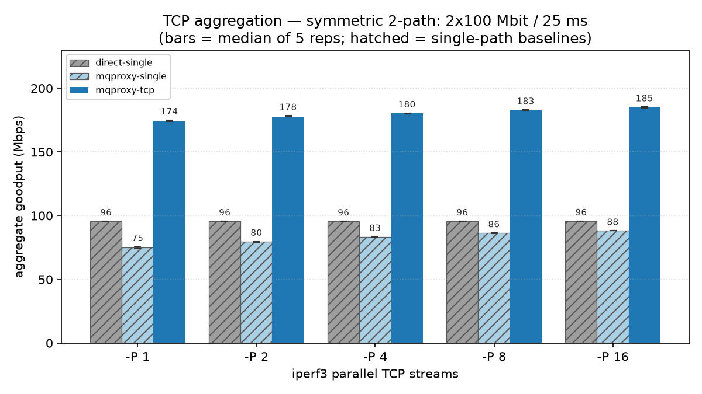

# mqproxy

A **multipath proxy** built on [Multipath QUIC](https://datatracker.ietf.org/doc/draft-ietf-quic-multipath/) (via a [fork of XQUIC](https://github.com/mp0rta/xquic)). A client/server pair carries application traffic over one MPQUIC tunnel, so apps get **bandwidth aggregation** and seamless failover across links (e.g. WiFi + LTE) without knowing anything about MPQUIC.

mqproxy maps each application flow onto an MPQUIC primitive:

| Mode | Mapping | Client flag |
|---|---|---|
| **TCP proxy** (SOCKS5 / HTTP CONNECT) | 1 TCP connection → 1 MPQUIC stream | `--socks5`, `--http-connect` |
| **HTTP gateway** | 1 HTTP request → 1 HTTP/3 stream | `--gateway` |
| **UDP relay** (SOCKS5 UDP ASSOCIATE) | 1 UDP session → MPQUIC DATAGRAMs | `--socks5` |
| **Transparent capture** | kernel-redirected TCP → 1 MPQUIC stream | `--tproxy` |
| **TLS MITM** (opt-in) | 1 browser HTTP/2 request → 1 HTTP/3 stream | `--tproxy --mitm` |

The client picks the mode with its ingress flags; the server serves them all. Only TLS MITM decrypts traffic — every other mode keeps TLS end-to-end between app and origin.

mqproxy is the L4/L7 sibling of [mqvpn](https://github.com/mp0rta/mqvpn) (an L3 VPN carrying IP packets in QUIC DATAGRAMs). They coexist: mqvpn for whole-device coverage, mqproxy for the flows you want aggregated.

## Why MPQUIC streams?

A QUIC stream is reassembled by offset, so one stream can be spread across several paths and still arrive intact. A single download carried as one stream is therefore aggregated across paths. A datagram tunnel can't do this: it either pins a flow to one path or reorders it.

In a 2 × 100 Mbit/s testbed, mqproxy speeds up a **single** TCP stream by **1.81×** (1.93× at 16 streams), while a flow-pinned L3 tunnel needs several parallel flows before it uses its second path. See the [benchmark report](docs/report/2026-06-23-single-tcp-aggregation-mqvpn-vs-mqproxy.md).



*`direct-single`: no tunnel, one path. `mqproxy-single`: tunnel over one path. `mqproxy-tcp`: tunnel aggregating one TCP stream over both paths.*

## Build

Needs Rust (the version is pinned in `rust-toolchain.toml`), plus a C/C++ toolchain, CMake, Go and Git. Cargo builds xquic and BoringSSL from the submodules and links them statically.

```bash
sudo apt-get install -y build-essential cmake git golang-go
git clone --recursive https://github.com/mp0rta/mqproxy.git
cd mqproxy
cargo build --release --locked -p mqproxy
```

Or install a prebuilt `.deb` (amd64/arm64) from [Releases](https://github.com/mp0rta/mqproxy/releases); see [Run as a service](#run-as-a-service).

## Quick start

```bash
# Server: MPQUIC on UDP :4433 (test cert for local use only)
./target/release/mqproxy server --listen 0.0.0.0:4433 --token secret123 \
  --cert tests/certs/test.crt --key tests/certs/test.key

# Client: SOCKS5 on :1080; each --path binds one local IP as an MPQUIC path
./target/release/mqproxy client --server <server-ip>:4433 --token secret123 \
  --socks5 127.0.0.1:1080 \
  --path 192.168.1.50 --path 10.20.0.30

curl --socks5-hostname 127.0.0.1:1080 https://example.com/
```

All flags: `mqproxy server --help`, `mqproxy client --help`.

### HTTP gateway

The client sends an HTTP request to an explicit API, and the server fetches it from the origin (origin TLS is always verified). Each request is its own HTTP/3 stream, so both downloads and uploads are aggregated. Useful for SDKs and server-to-server calls.

```bash
./target/release/mqproxy client --server <server-ip>:4433 --token secret123 \
  --gateway 127.0.0.1:8080

curl -X POST http://127.0.0.1:8080/_mqproxy/fetch \
  -H "X-Mq-Auth: Bearer secret123" \
  -H "X-Mq-Target: https://example.com/large.bin" \
  -o large.bin            # add -H "X-Mq-Method: PUT" --data-binary @f to upload
```

Optional request headers:

| Header | Effect |
|---|---|
| `X-Mq-Method` | Method used toward the origin (default `GET`) |
| `X-Mq-Origin-Protocol` | `h1` forces HTTP/1.1; `h2` (or no header) negotiates h2 or HTTP/1.1 |
| `X-Mq-Accept-Encoding` | Asks for compression on the download |
| `X-Mq-Forward-Cookie` | Forwards `Cookie` to the origin (withheld by default) |

Errors come back as HTTP statuses (DNS failure 502, connect timeout 504, bad token 403, …). The server pools origin connections. Server flags: `--no-gateway`, `--origin-ca <pem>`, `--request-metrics`, `--masquerade` (unauthenticated requests get a bare 404 instead of 403; recommended on internet-facing servers).

### UDP relay

UDP relay uses the same `--socks5` listener, through SOCKS5 UDP ASSOCIATE. Packets travel as DATAGRAMs and are never retransmitted, so DNS, game and VoIP traffic stays latency-first. `curl` can't speak UDP ASSOCIATE; use the bundled test client instead:

```bash
./target/release/examples/udpsocks --proxy 127.0.0.1:1080 --target 8.8.8.8:53 --send 32 --count 1
```

Server flags: `--udp-idle-timeout <sec>` (default 60), `--no-udp`. A client running only `--gateway` has no UDP relay.

### Transparent capture (Linux, IPv4)

TCP is redirected in the kernel, so apps need no proxy settings. Traffic is relayed byte-for-byte; TLS is not touched.

```bash
# Single host: capture this machine's outbound TCP :443. Needs root or CAP_NET_ADMIN.
sudo ./target/release/mqproxy client --server <server-ip>:4433 --token secret123 \
  --tproxy 127.0.0.1:12443 --setup-redirect     # --tproxy-dport <port> to change 443

curl https://example.com/                       # captured, no proxy flags
```

- `--setup-redirect` adds the nft rules (`nat OUTPUT` REDIRECT) at start and removes them at exit. You can instead write your own rules and just point them at the listener.
- **Router** (forwarded LAN traffic): use `--tproxy-mode tproxy`, which needs a `mangle PREROUTING` TPROXY rule plus policy routing. Leave `--setup-redirect` off and set `--tproxy-fwmark` / `--tproxy-table` (defaults 1 / 100) to match your rules.
- **Loop avoidance:** outbound traffic from `--tproxy-uid` (default: the process's euid) is not redirected. Run mqproxy as a dedicated non-root user; with uid 0, all root traffic would bypass capture.

## TLS MITM

`--mitm` turns transparent capture into an HTTP/2-terminating proxy. For each connection, the client reads the SNI, forges a leaf certificate signed by **your** CA, terminates TLS, and sends each HTTP/2 request on its own HTTP/3 stream. Requests no longer block one another, and each one is scheduled across paths independently.

> **Trust model:** This is for an operator who controls the device (like a corporate proxy or personal VPN), not for intercepting third parties. It works only on devices that trust your CA. The CA key is the trust anchor: mqproxy refuses a key that is a symlink, belongs to another user, or is readable by group or others.

```bash
# CA: unencrypted PKCS#8 key (PKCS#1/SEC1/encrypted keys are rejected with a conversion hint)
openssl req -x509 -newkey ec -pkeyopt ec_paramgen_curve:P-256 -nodes \
  -keyout mitm-ca.key -out mitm-ca.crt -days 825 -subj "/CN=mqproxy MITM CA" \
  -addext basicConstraints=critical,CA:TRUE -addext keyUsage=critical,keyCertSign
  # optional scope: -addext "nameConstraints=critical,permitted;DNS:example.com"
chmod 600 mitm-ca.key

sudo ./target/release/mqproxy client --server <server-ip>:4433 --token secret123 \
  --tproxy 127.0.0.1:12443 --setup-redirect \
  --mitm --ca-cert mitm-ca.crt --ca-key mitm-ca.key \
  --ignore-host signal.org --ignore-hosts .apple.com,.icloud.com
```

- **Fail-closed:** if `--tproxy`, `--ca-cert` or `--ca-key` is missing, or the CA or an ignore entry is invalid, mqproxy exits with code 2 at startup. It never quietly falls back to passthrough.
- **Relayed opaquely** (origin's real cert, no inspection) are: clients without `h2` in ALPN (including HTTP/1.1 and WebSocket), non-TLS traffic, missing/invalid/IP SNI, ignored hosts, hosts outside the CA's `nameConstraints`, TLS settings incompatible with the forged cert, a ClientHello over 8 KiB or slower than 5 s, and connections past 256 concurrent.
- **Ignore hosts** (for cert-pinned apps): `example.com` matches that host only, and `.example.com` matches only its subdomains. List both to cover a site and its subdomains.
- **Block UDP/443** on the capture path, or browsers may switch to HTTP/3 and bypass the proxy. mqproxy already strips `alt-svc` from responses.
  ```bash
  nft add table inet mqproxy_block
  nft add chain inet mqproxy_block forward '{ type filter hook forward priority 0; }'
  nft add rule  inet mqproxy_block forward udp dport 443 reject   # use "output" for local browsers
  ```
- **Requests:** a request whose `:authority` doesn't match the SNI gets 421. Header limits are 8 KiB per field, 32 KiB per header section, and 256 fields; a request over the limits gets 431 or a stream reset. HTTP/2 allows 128 concurrent streams per connection. Browser-supplied `X-Mq-*` headers are always stripped; `Cookie` and `Authorization` are forwarded.
- **Leaf certs** are valid for 24 h and cached in memory, keyed by SNI.

## Configuration file

`--config <path>` reads an INI file, which keeps the token off the command line. Values are resolved in the order defaults < file < CLI flags.

```ini
# /etc/mqproxy/edge1.conf  (chmod 0600; mqproxy warns if group/world-readable)
[Interface]
Listen   = 0.0.0.0:4433
MaxConns = 64

[TLS]
Cert = /etc/mqproxy/tls/edge1.pem
Key  = /etc/mqproxy/tls/edge1.key

[Auth]
Key = your-shared-token

[Multipath]
CC        = bbr
Scheduler = minrtt
```

| Section | Server keys | Client keys |
|---|---|---|
| `[Interface]` | `Listen`, `MaxConns` | `Reconnect`, `KeepaliveIdle`, `ReconnectMaxBackoff` |
| `[Server]` | — | `Address`, `ClientId` |
| `[TLS]` | `Cert`, `Key` | — |
| `[Auth]` | `Key` | `Key` |
| `[Multipath]` | `CC`, `Scheduler` | `CC`, `Scheduler`, `Path`* |
| `[Ingress]` | — | `Socks5`, `HttpConnect`, `Gateway`, `TProxy`, `Mode`, `Fwmark`, `Table`, `Dport`, `SetupRedirect`, `SkipUid` |
| `[Gateway]` | `Enabled`, `Masquerade`, `OriginCA` | — |
| `[Mitm]` | — | `Enabled`, `CACert`, `CAKey`, `IgnoreHosts`* |
| `[UDP]` | `Enabled`, `IdleTimeout` | — |
| `[Metrics]` | `Interval`, `PerRequest` | `Interval` |
| `[Log]` | `QLog` | `QLog` |

\* repeatable, one value per line. Keys are case-insensitive. Comments (`#` or `;`) must sit on their own line. Booleans accept `true`, `yes` or `1`. An unknown key or bad value prints a warning and is skipped; a missing config file is fatal. Full examples: [`server.conf.example`](server.conf.example), [`client.conf.example`](client.conf.example).

## Run as a service

The package installs `/usr/bin/mqproxy`, hardened `mqproxy-server@` / `mqproxy-client@` systemd templates, a `mqproxy` system user, and `/etc/mqproxy`.

```bash
sudo apt install ./mqproxy_<version>_amd64.deb   # or build one: python3 packaging/build.py → target/dist/

sudoedit /etc/mqproxy/edge1.conf
sudo chown mqproxy:mqproxy /etc/mqproxy/edge1.conf && sudo chmod 0600 /etc/mqproxy/edge1.conf
sudo systemctl enable --now mqproxy-server@edge1   # instance name = config basename
journalctl -u mqproxy-server@edge1 -f
```

- The instance name is also passed as `--instance-id`, so it shows up in the logs.
- qlog can only be written to `/var/log/mqproxy` (`[Log] QLog = /var/log/mqproxy`).
- Listening on a port below 1024 needs `AmbientCapabilities=CAP_NET_BIND_SERVICE`, added via `systemctl edit`.

## Operations

- **Reconnect:** if the tunnel drops, the client reconnects with jittered exponential backoff (`--reconnect-max-backoff`, default 30 s) and keeps its listeners up. While idle, QUIC PINGs keep the tunnel alive (`--keepalive-idle`). Flows that are in flight when the connection is lost fail; new flows work again once the tunnel is back.
- **Connection cap:** `--max-conns` (default 16) limits the server's QUIC connections. At the cap, the oldest unauthenticated connection is evicted to make room.
- **Metrics:** `--metrics-interval <sec>` logs per-path `mq.conn` / `mq.path` lines; with `--mitm`, the client also logs `mq.mitm` counters. `--request-metrics` logs one `mq.req` line per gateway request.
- **qlog:** `--qlog <dir>` writes xquic qlog. Per-path byte counts there show whether a flow is really split across paths.
- **Tuning:** `--cc bbr|bbr2|cubic` and `--scheduler minrtt|backup|wlb`.

## Testing

```bash
cargo test --workspace --locked
cargo clippy --workspace --all-targets --locked -- -D warnings
cargo build --release --locked -p mqproxy --bins --examples
bash tests/test_cli_help.sh target/release/mqproxy
bash tests/integration/e2e_udp.sh     # also e2e_{gateway,multipath,tproxy,mitm_h2,...}.sh
```

End-to-end scripts that need root or `NET_ADMIN` skip themselves when run unprivileged.

## License

Apache-2.0 (see [LICENSE](LICENSE)). Provided "AS IS", without warranty; you are responsible for validating it for your use.

Built on [XQUIC](https://github.com/alibaba/xquic) ([mp0rta fork](https://github.com/mp0rta/xquic)), [BoringSSL](https://boringssl.googlesource.com/boringssl), [h3wire](https://crates.io/crates/h3wire), [hyper](https://hyper.rs/), h2 and [rustls](https://rustls.dev/). Bundled dependency licenses ship with release artifacts.
