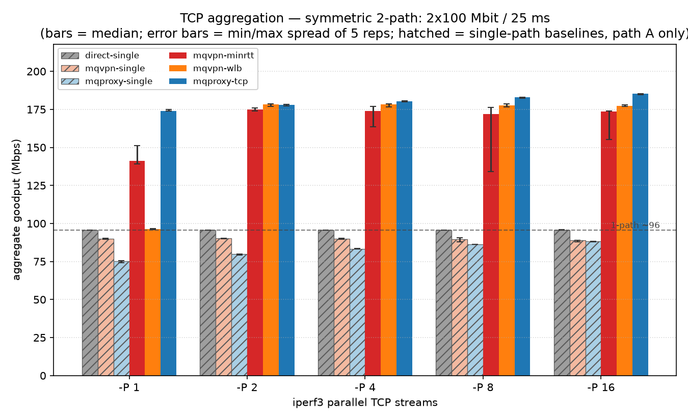
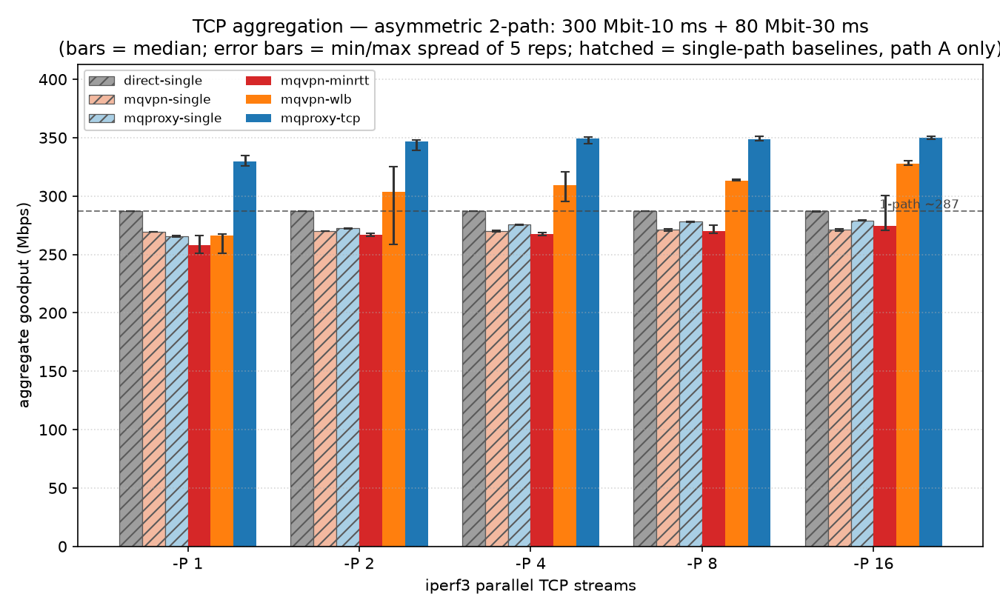

# TCP Aggregation: mqproxy vs mqvpn

Date: 2026-06-23

## Summary

mqproxy's TCP-proxy mode aggregates a **single TCP stream** across two MPQUIC
paths — even at one stream (`-P 1`) — because it terminates TCP and re-streams
the bytes as one MPQUIC STREAM that the scheduler may split freely. An L3
datagram tunnel (mqvpn) cannot: to avoid reordering the *inner* TCP it pins a
flow to a single path, so it aggregates only once there are **multiple**
parallel flows to spread.

This is not "mqproxy is faster than mqvpn" — they are complementary layers. It
is a structural property: **stream termination gives single-flow aggregation
that flow-pinned datagram tunneling structurally cannot.**

Headline (median over 5 reps, 2 × 100 Mbit/s symmetric, 25 ms each;
1-path baseline = `direct` = 96 Mbps):

| condition        | mqvpn-wlb | mqproxy-tcp |
|------------------|----------:|------------:|
| `-P 1` (1 flow)  | 96 (1.00×) | **174 (1.81×)** |
| `-P 16`          | 177 (1.84×) | **185 (1.93×)** |

mqproxy aggregates from the first stream. mqvpn-wlb aggregates only from
`-P 2` upward — a single flow stays pinned to one path (96 ≈ single-path).

## Mechanism

**mqproxy** terminates the inner TCP at the proxy and re-emits the bytes as an
MPQUIC **STREAM**. Because a QUIC stream is reassembled by offset, its STREAM
frames may be spread across paths and reordered on the wire while correctness is
preserved; the receiver restores order before writing the upstream TCP socket.
No inner congestion-control loop ever observes the cross-path reorder, so a
single byte stream aggregates under any scheduler-decided split.

**mqvpn** encapsulates IP packets as MPQUIC **DATAGRAMs**, leaving the inner
TCP's congestion control end-to-end. If the scheduler sprays one flow's packets
across paths of differing RTT/jitter, the inner TCP misreads the cross-path
reorder as loss and stalls. mqvpn's `wlb` scheduler therefore **pins each inner
flow to one path** (hashed by flow) and aggregates by spreading *different*
flows across paths — so it needs `-P ≥ 2` to engage the second path. `minrtt`
instead sprays per-packet, which aggregates on symmetric paths but degrades
under RTT asymmetry (see asymmetric results).

> The mqvpn-wlb numbers here reflect a recent fix to mqvpn's `wlb` scheduler
> (prompt secondary-path detection, mp0rta/xquic). Before it, on a *symmetric*
> fabric `wlb` could leave a freshly-joined second path u/nused and collapse all
> flows onto the first — multi-stream throughput stuck near single-path
> (~96 Mbps), with run-to-run bistability. After the fix the second path joins
> while still cold and flows distribute evenly; symmetric `-P ≥ 2` reaches
> ~1.85× single-path, stable across reps. mqproxy's STREAM-based aggregation
> never depended on that scheduler behaviour.

## Method

Two Linux netns (`client`, `server`) wired by two veth pairs (path A:
`veth1`↔`veth1_p`, path B: `veth2`↔`veth2_p`) — the same 2-netns direct layout
as mqvpn's own CI bench, giving mqvpn its strongest condition for engaging the
second path. Each veth shaped with `tc-netem delay <one-way> rate <bw>
limit 25000`.

| profile     | path A           | path B           |
|-------------|------------------|------------------|
| symmetric   | 25 ms / 100 Mbit | 25 ms / 100 Mbit |
| asymmetric  | 10 ms / 300 Mbit | 30 ms / 80 Mbit  |

Matrix: 6 variants × 5 stream counts (`-P 1,2,4,8,16`) × 2 profiles × **5 reps =
300 transfers**, `iperf3 -t 20 -O 2 -R` (downlink, 2 s warm-up discarded). Each
cell is a fresh netns + fresh tunnel lifecycle (no cross-cell state leak).

| variant          | what it measures |
|------------------|------------------|
| `direct`         | single-path baseline, no tunnel — **path A only** |
| `mqvpn-single`   | mqvpn tunnel bound to one path — **path A only**, tunnel-overhead floor |
| `mqproxy-single` | mqproxy tunnel bound to one path — **path A only**, tunnel-overhead floor |
| `mqvpn-minrtt`   | mqvpn, both paths, per-packet min-RTT scheduler |
| `mqvpn-wlb`      | mqvpn, both paths, weighted-load-balancing (flow-pinned) scheduler |
| `mqproxy-tcp`    | mqproxy TCP proxy (SOCKS5), both paths |

The three `*-single` baselines (and `direct`) bind **only path A** (`veth1`). On
the symmetric profile path A is one of the 100 Mbit paths; on the **asymmetric**
profile path A is the **300 Mbit / 10 ms wide path**, so those baselines ride the
wide path alone (≈ 266–287 Mbps) — that is the bar the 2-path variants must beat
to demonstrate aggregation.

Pins: mqproxy builds against xquic `mqvpn-dev` (`7c444e8`); mqvpn builds the
WLB-fixed xquic (`10139ce`, a descendant of `7c444e8` adding the three-commit
`wlb` scheduler fix below). The only delta between the two is that `wlb`
scheduler fix, which never touches mqproxy's STREAM path — so the comparison is
on the same MPQUIC machinery. Bench contract:
`tests/integration/bench_single_tcp_aggregation.sh`.

## Results

### Symmetric paths (2 × 100 Mbit, 25 ms each)



| variant | P=1 | P=2 | P=4 | P=8 | P=16 |
|---|--:|--:|--:|--:|--:|
| direct (1-path) | 96 | 96 | 96 | 96 | 96 |
| mqvpn-single | 90 | 90 | 90 | 90 | 89 |
| mqproxy-single | 75 | 80 | 83 | 86 | 88 |
| mqvpn-minrtt | 141 | 175 | 174 | 172 | 174 |
| mqvpn-wlb | 96 | 178 | 178 | 178 | 177 |
| **mqproxy-tcp** | **174** | **178** | **180** | **183** | **185** |

mqproxy reaches 1.81× single-path at `-P 1` and 1.93× at `-P 16`. mqvpn-wlb
matches it from `-P 2` (1.84×) but a single flow (`-P 1`) is pinned to one path
(96 ≈ single-path). `minrtt` also aggregates here (per-packet spray works when
both paths have equal timing).

### Asymmetric paths (path A 300 Mbit/10 ms, path B 80 Mbit/30 ms)



| variant | P=1 | P=2 | P=4 | P=8 | P=16 |
|---|--:|--:|--:|--:|--:|
| direct (1-path) | 287 | 287 | 287 | 287 | 287 |
| mqvpn-single | 269 | 270 | 270 | 271 | 272 |
| mqproxy-single | 266 | 273 | 276 | 278 | 279 |
| mqvpn-minrtt | 258 | 267 | 267 | 270 | 275 |
| mqvpn-wlb | 266 | 304 | 309 | 313 | 328 |
| **mqproxy-tcp** | **330** | **346** | **350** | **349** | **350** |

Theoretical max ≈ 380 (300 + 80); single wide path (`direct`) = 287. mqproxy
exceeds the single wide path from the first stream (330, 1.15×) and reaches
350 (1.22×, 92 % of theoretical) by `-P 16`. mqvpn-wlb aggregates from `-P 2`
(304) up to 328 (1.14×) at `-P 16`, with wider run-to-run spread than symmetric.
`minrtt` stays at or below the single wide path (258–275 vs 287) — per-packet
spray across a 10 ms vs 30 ms gap reorders enough to drag the fast path.

Error bars on the figures are min/max spread of 5 reps, not a statistical CI.

## Interpretation

The figure makes mqproxy's margin visually unmistakable: `mqproxy-tcp` sits above
every other variant at all stream counts, and is the **only** bar that clears the
single-path baseline at `-P 1`. That gap is large and consistent — not marginal —
and it is the direct payoff of **QUIC stream multiplexing + MPQUIC**. Mapping each
flow to its own QUIC STREAM means the bytes of one transfer are reassembled by
offset, so the MPQUIC scheduler can split them across both paths and let either
path deliver out of order without any inner congestion-control loop misreading the
reorder as loss. A datagram tunnel gets no such freedom — to protect the inner
TCP it must pin a flow to a single path — so the multiplexing/MPQUIC advantage
shows up as a step change at `-P 1` and a sustained lead beyond it, rather than a
few percent.

- **Single-flow aggregation is mqproxy's structural niche.** Terminating TCP and
  re-streaming as one MPQUIC STREAM lets the scheduler split bytes across paths
  with no inner CC to misread the reorder — so even `-P 1` aggregates (1.81×
  symmetric, 1.15× asymmetric). An L3 datagram tunnel cannot do this without
  risking inner-TCP reorder, which is exactly why mqvpn pins a flow to one path.
- **Multi-flow, both aggregate.** With `-P ≥ 2`, mqvpn-wlb and mqproxy-tcp are
  close on symmetric paths (177 vs 185). On asymmetric paths mqproxy leads more
  clearly (350 vs 328), and `minrtt` is the wrong tool (its per-packet spray
  loses to RTT asymmetry).
- **Complementary, not competing.** mqvpn is a general L3 multipath IP tunnel;
  mqproxy is an L4/L7 multipath proxy. For multiplexed IP traffic (many flows)
  an L3 tunnel aggregates fine; for a *single* large transfer, or where you can
  proxy at the flow/request layer, mqproxy's stream termination is the structural
  advantage.

## Reproduction

```bash
# Linux + root; iperf3, iproute2, socat 1.8+, python3-matplotlib;
# mqproxy built (build/mqproxy) and mqvpn built next to it (../mqvpn).
# Both pin xquic to mqvpn-dev (7c444e8).
sudo REPEAT=5 tests/integration/bench_single_tcp_aggregation.sh
```

CSV →
[`docs/report/bench_results/2026-06-23-single-tcp-aggregation.csv`](bench_results/2026-06-23-single-tcp-aggregation.csv),
figures → `docs/report/figures/`.
Wall-clock ≈ 2.5 h for the 6 × 5 × 2 × 5 matrix.

## Caveats

- **Median over 5 reps**; error bars are min/max spread, not statistical CIs.
- **mqproxy falls short of the theoretical maximum** (185 vs ~190 Mbps symmetric;
  350 vs ~380 asymmetric): per-path cwnd-block spillover and reorder overhead are
  inherent to splitting one byte stream across shaped paths.
- **Shaped-veth testbed**, not a real network — CPU scheduling, MTU, and GRO/GSO
  at kernel defaults; expect a few percent run-to-run jitter.
- **Not in CI** — needs a side-by-side mqvpn build to compare against, absent from
  the mqproxy CI image. Manual reproduction harness only.
